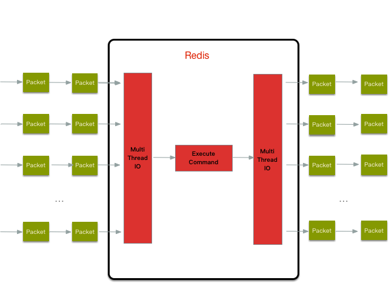

# Thread IO

Thread IO used to perform Network IO operation and parse query when a listened fd is readable.

The server can run/stop the thread IO when necessary.

```C++
list *io_threads_list[IO_THREADS_MAX_NUM];

void *IOThreadMain(void *myid) {
    while(1) {
        /* Wait for start */
        for (int j = 0; j < 1000000; j++) {
            if (io_threads_pending[id] != 0) break;
        }

        /* Give the main thread a chance to stop this thread. */
        if (io_threads_pending[id] == 0) {
            pthread_mutex_lock(&io_threads_mutex[id]);
            pthread_mutex_unlock(&io_threads_mutex[id]);
            continue;
        }

        listIter li;
        listNode *ln;
        listRewind(io_threads_list[id],&li);
        while((ln = listNext(&li))) {
            client *c = listNodeValue(ln);
            if (io_threads_op == IO_THREADS_OP_WRITE) {
                writeToClient(c,0);
            } else if (io_threads_op == IO_THREADS_OP_READ) {
                readQueryFromClient(c->conn);
            } else {
                serverPanic("io_threads_op value is unknown");
            }
        }
        listEmpty(io_threads_list[id]);
        io_threads_pending[id] = 0;
    }
}

void initThreadedIO(void) {
    for (int i = 0; i < server.io_threads_num; i++) {
        pthread_mutex_init(&io_threads_mutex[i],NULL);
        pthread_mutex_lock(&io_threads_mutex[i]); /* Thread will be stopped. */
        pthread_create(&tid,NULL,IOThreadMain,(void*)(long)i)
        io_threads[i] = tid;
    }
}

void startThreadedIO(void) {
    for (int j = 1; j < server.io_threads_num; j++)
        pthread_mutex_unlock(&io_threads_mutex[j]);
}

void stopThreadedIO(void) {
    // handle client pending read before stop thread
    handleClientsWithPendingReadsUsingThreads();
    for (int j = 1; j < server.io_threads_num; j++)
        pthread_mutex_lock(&io_threads_mutex[j]);
}
```

1. When a client is readable, its read handler **readQueryFromClient** adds this client to **server.clients_pending_read**, flags the client with **CLIENT_PENDING_READ**.

2. All read events handled in **afterSleep** after each event loop(after **epoll_wait** returns) uniformly, it calls **handleClientsWithPendingReadsUsingThreads** to distribute the read ready client to Thread IOs using Round-Robin algorithm, Thread IOs call **readQueryFromClient** to reads the client request, parses query.

3. The main busy waits all Thread IOs finish network read, query parsing work, and then execute the all query command uniformly.

  

1. When replying to a client, store the data to the client reply buffer, flag the client with **CLIENT_PENDING_WRITE**, and add the client to **server.clients_pending_write**

2. All writing events are handled in **beforeSleep** before each event loop uniformly.

   1. If the number of pending write clients is less than the number two times of the Thread IO, stop Thread IO, and handle writing events synchronously.

   2. If can't send all data at once, install a writing handler for that client. The remained data is sent after **epoll_wait** returns for that client, which is writable.

    ```C++
   if (clientHasPendingReplies(c) &&
       connSetWriteHandler(c->conn, sendReplyToClient) == AE_ERR)
   {
     freeClientAsync(c);
   }
    ```
